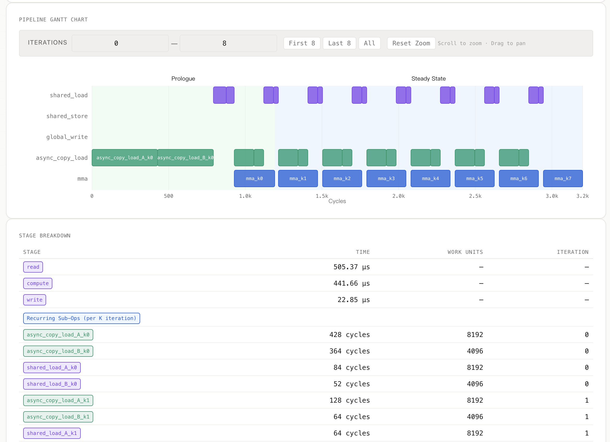
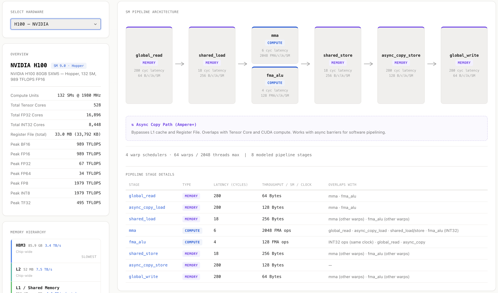

# OpCompass

OpCompass is a GPU operator Speed-of-Light (SOL) estimator. Given an operator, shape, dtype, and target GPU, it estimates best-case runtime from compute throughput, memory movement, tiling, occupancy, and pipeline-stage constraints.

The project is aimed at answering questions such as:

- What is the theoretical lower-bound runtime for this operator on A100/H100/B200?
- Is the bottleneck HBM, shared memory, tensor cores, CUDA cores, or epilogue writeback?
- How do tile shape, software pipeline stage count, warp count, async copy, and sparsity affect a matmul kernel?
- Which hardware features are visible in the modeled pipeline, such as Ampere `cp.async`, Hopper TMA/WGMMA, and Blackwell TMEM/Store-TMA?





## Current Capabilities

### Analysis Modes

| Mode | Purpose | Current status |
|------|---------|----------------|
| `hierarchy_roofline` | Multi-tier roofline estimate using FLOPs and memory hierarchy bandwidth | Available for all operators with FLOP/IO formulas |
| `pipeline` | CTA-level pipeline schedule with sub-op timelines, tiling, occupancy, stage bottlenecks, and memory breakdowns | Detailed implementation for matmul |
| `solar` | SOLAR graph analysis through vendored `3rdparty/SOLAR` | Available where the SOLAR path supports the workload |

### Operators

The registry discovers operator classes automatically from `opcompass/operators/`.

Currently included:

- `matmul`: full roofline and detailed pipeline mode.
- `convolution`: roofline-style FLOP/IO model.
- `flash_attention`: roofline-style FLOP/IO model.
- `layernorm`: roofline-style FLOP/IO model.
- `elementwise`: roofline-style FLOP/IO model.
- `reduction`: roofline-style FLOP/IO model.

Pipeline mode is currently matmul-first. Other operators fall back to non-pipeline analysis until they define `get_ops_breakdown()`.

### Hardware Models

The registry discovers hardware classes automatically from `opcompass/hardware/`.

Supported NVIDIA generations and targets include:

- Fermi: `gf100`
- Kepler: `gk110`
- Maxwell: `gm204`
- Pascal: `p100`
- Volta: `v100`
- Turing: `rtx6000`
- Ampere: `a100`
- Hopper: `h100`, `h100_pcie`
- Blackwell: `b200`, `b300`, `gb200`, `gb300`

Hardware models include compute peaks, memory hierarchy, SM resources, occupancy limits, pipeline stages, and architecture-specific stage descriptions.

### Matmul Pipeline Model

Pipeline matmul mode currently models:

- Architecture-aware candidate selection for tile shape, software stage count, and warp count.
- Forced user overrides for `block_m`, `block_n`, `block_k`, `stage_count`, and `warp_count`.
- Candidate rejection for instruction granularity, shared-memory usage, register pressure, per-block register limits, and per-thread register limits.
- CTA-level recurring mainloop sub-ops: async/global loads, shared loads, and MMA/FMA compute.
- Architecture-specific epilogues:
  - Ampere and older: shared store plus `global_write`.
  - Hopper: shared store plus TMA `async_copy_store`.
  - Blackwell: `tmem_load`, shared store, and dedicated Store-TMA `async_copy_store`.
- Software-pipeline stage depth through `prefetch_distance = stage_count - 1`.
- Async copy and TMA overlap with compute.
- 2:4 structured sparsity as an MMA throughput multiplier.
- Logical CTA memory traffic vs effective HBM traffic after first-order L2 reuse.
- Occupancy limits from threads, warps, shared memory, register file capacity, and register allocation limits.
- Gantt chart visualization of scheduled sub-ops and cycle ranges.

Important current approximations:

- Hopper/Blackwell warp specialization is represented as candidate metadata and throughput/stage differences, not as separate producer/consumer warp-group scheduling.
- TMA barriers, wait groups, WGMMA wait/commit, and `mbarrier` costs are not explicitly modeled.
- L2 reuse is a first-order capacity model, not a CTA-order/cache-set simulation.
- Persistent kernels, split-K, fused epilogues, and mixed-precision kernels are not fully represented.

## Quick Start

Install for local development:

```bash
pip install -e .
```

Install development dependencies:

```bash
pip install -e ".[dev]"
```

List discovered operators and hardware:

```bash
compass list operators
compass list hardware
```

Run a representative matmul analysis:

```bash
compass analyze matmul \
  --hardware a100 \
  --dtype fp16 \
  --M 4096 --N 4096 --K 4096
```

Run detailed pipeline mode:

```bash
compass analyze matmul \
  --hardware h100 \
  --dtype fp16 \
  --mode pipeline \
  --M 4096 --N 4096 --K 4096
```

Force a pipeline candidate shape:

```bash
compass analyze matmul \
  --hardware a100 \
  --dtype fp16 \
  --mode pipeline \
  --block-m 128 --block-n 128 --block-k 32 \
  --stage-count 3 --warp-count 4 \
  --M 4096 --N 4096 --K 4096
```

Sweep shapes:

```bash
compass sweep matmul \
  --hardware a100,h100,b200 \
  --M 1024,2048,4096 \
  --N 1024,2048,4096 \
  --K 1024,2048,4096
```

## Web UI

Start the API and static Web UI:

```bash
uvicorn opcompass.server:app --reload
```

Open:

```text
http://127.0.0.1:8000
```

The Web UI currently includes:

- Overview comparison across hardware targets.
- Hardware detail pages with memory hierarchy, SM resources, and modeled pipeline stages.
- Operator analysis with roofline charts and detailed metrics.
- Pipeline mode controls for async copy, sparsity, tile shape, stage count, and warp count.
- Pipeline schedule stats, tiling/candidate information, Gantt chart, memory breakdown, stage table, and guidance.
- Architecture-aware hardware pipeline visualization that distinguishes Hopper TMA and Blackwell TMEM/Store-TMA stages.

## Project Structure

```text
opcompass/
├── opcompass/
│   ├── models.py             # Shared dataclasses and enums
│   ├── registry.py           # Dynamic operator/hardware discovery
│   ├── cli.py                # Click CLI
│   ├── server.py             # FastAPI API and static Web UI server
│   ├── engine/
│   │   ├── analyzer.py       # Main analysis orchestrator
│   │   ├── compute_model.py  # Compute throughput helpers
│   │   ├── memory_model.py   # Memory hierarchy helpers
│   │   ├── pipeline_model.py # CTA-level pipeline scheduler
│   │   └── result.py         # Result serialization/formatting
│   ├── operators/            # Operator implementations
│   ├── hardware/             # Hardware target implementations
│   └── configs/solar_arch/   # SOLAR architecture YAML files
├── web/                      # Vanilla JS frontend
├── tests/                    # Pytest suite
├── docs/
│   ├── design/               # Design notes
│   ├── hardware/             # Hardware reference PDFs
│   └── images/               # README/UI images
└── 3rdparty/SOLAR/           # Vendored SOLAR dependency
```

## Development

Run tests:

```bash
pytest
```

Run focused pipeline tests:

```bash
pytest tests/test_engine/test_pipeline_model.py
```

Run CLI tests:

```bash
pytest tests/test_cli.py
```

## Adding a New Operator

Create a module under `opcompass/operators/` and subclass `Operator`.

Minimum roofline support requires:

- `name`
- `description`
- `param_dims`
- `compute_flops()`
- `compute_io_bytes()`

Detailed pipeline support additionally requires:

- `get_tiling_strategy()`
- `get_pipeline_candidates()` when candidate search is needed
- `get_ops_breakdown()` returning `SubOp` instances with explicit `pipeline_stage`, `depends_on`, and recurrence metadata

## Adding a New Hardware Target

Create a module under `opcompass/hardware/` and subclass `Hardware`.

At minimum, define:

- `name`, `vendor`, `description`
- `memory: MemoryHierarchy`
- `compute_unit: ComputeUnit`
- dtype-specific `peak_flops`

For useful pipeline mode, also define:

- `compute_unit.pipeline: list[PipelineStage]`
- SM occupancy limits: threads, warps, blocks, shared memory, registers
- architecture-specific pipeline stages and descriptions

## TODO

Near-term modeling work:

- Replace the fixed matmul stage grouping with dependency-graph scheduling based on `SubOp.depends_on`.
- Split memory timing into copy engine, L2, and HBM resources instead of only `max(local copy, effective HBM)`.
- Add explicit barrier/wait costs for `cp.async`, TMA, WGMMA, and `mbarrier`.
- Model Hopper/Blackwell producer/consumer warp specialization instead of treating it as metadata.
- Refine register pressure for accumulator fragments, operand fragments, stage buffers, and warp-specialized roles.
- Improve L2 reuse with CTA order, swizzling/grouping, reuse distance, and per-slice/GPC capacity assumptions.

Operator coverage:

- Add pipeline templates for convolution, starting with implicit-GEMM convolution.
- Add flash-attention pipeline modeling for QK, softmax, and PV phases.
- Add reduction pipeline templates with multi-level shared-memory/global reduction stages.
- Add fused matmul epilogues: bias, activation, residual add, scaling, quantization.

Accuracy and validation:

- Compare representative predictions against cuBLAS/CUTLASS/Nsight Compute measurements.
- Track calibration data for runtime, achieved TFLOPS, DRAM bytes, L2 hit rate, tensor-core utilization, shared-memory throughput, and occupancy.
- Add confidence/known-limitations reporting to CLI/API/Web results.
- Model partial tiles, small-grid tail effects, and K remainders more accurately.

Frontend:

- Add Gantt hover tooltips with sub-op name, stage, iteration, duration, and work units.
- Add side-by-side pipeline comparison for tile/stage/sparsity variants.
- Improve schedule guidance so recommendations are derived from the actual bottleneck and rejected candidates.

## License

MIT
